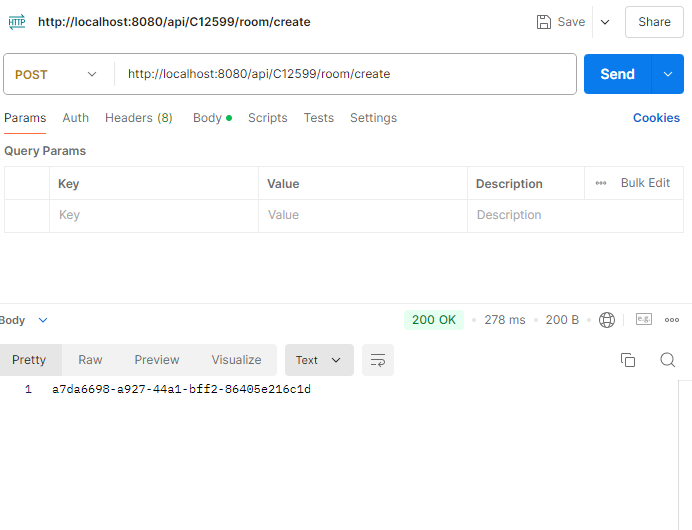
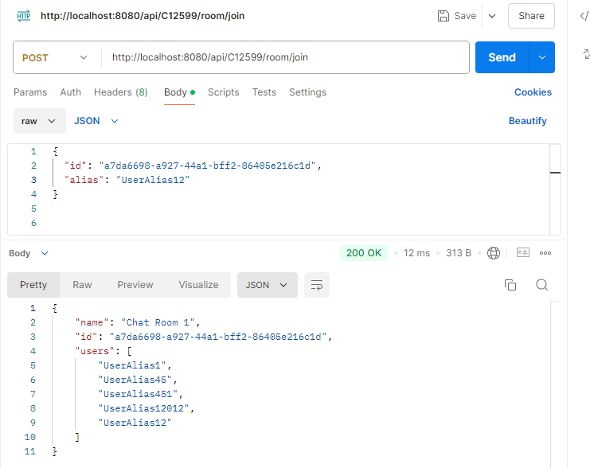
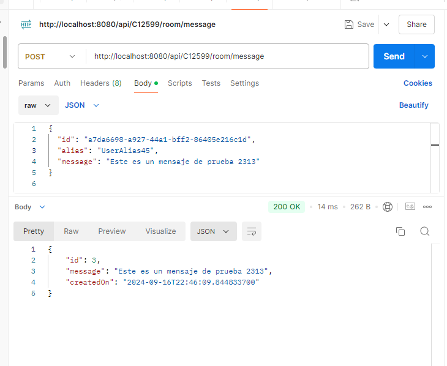
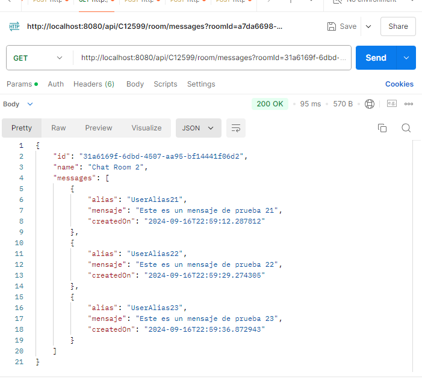

# Pruebas del API de Conversaciones Anónimas

## Introducción

Este documento proporciona detalles sobre las pruebas realizadas para la API de Conversaciones Anónimas desarrollada en el marco de la tarea de Spring Boot. Las pruebas se llevaron a cabo utilizando Postman para asegurar el correcto funcionamiento de los endpoints de la API.

## Endpoints y Pruebas Realizadas

### 1. Crear una Sala

- **URL:** `api/{carnet}/room/create`
- **Método:** POST
- **Payload de Ejemplo:**
  ```json
  {
    "name": "Sala de Prueba",
    "createdBy": "UsuarioTest"
  }
  ```
- **Respuesta Esperada:**
  ```json
  {
    "id": "id_de_sala_generado"
  }
  ```
- **Imagen de Prueba:**
  

### 2. Registrar Usuario en una Sala Existente

- **URL:** `api/{carnet}/room/join`
- **Método:** POST
- **Payload de Ejemplo:**
  ```json
  {
    "id": "id_de_sala_generado",
    "alias": "UsuarioNuevo"
  }
  ```
- **Respuesta Esperada:**
  ```json
  {
    "id": "id_de_sala_generado",
    "name": "Sala de Prueba",
    "users": ["UsuarioTest", "UsuarioNuevo"]
  }
  ```
- **Imagen de Prueba:**
  

### 3. Enviar Mensaje a la Sala

- **URL:** `api/{carnet}/room/message`
- **Método:** POST
- **Payload de Ejemplo:**
  ```json
  {
    "id": "id_de_sala_generado",
    "alias": "UsuarioNuevo",
    "message": "Hola a todos!"
  }
  ```
- **Respuesta Esperada:**
  ```json
  {
    "id": "id_del_mensaje_generado",
    "createdOn": "fecha_y_hora_iso8601",
    "message": "Hola a todos!"
  }
  ```
- **Imagen de Prueba:**
  

### 4. Leer Todos los Mensajes en Orden Cronológico

- **URL:** `api/{carnet}/room/message`
- **Método:** GET
- **Payload de Ejemplo:**
  ```json
  {
    "id": "id_de_sala_generado"
  }
  ```
- **Respuesta Esperada:**
  ```json
  {
    "id": "id_de_sala_generado",
    "name": "Sala de Prueba",
    "messages": [
      {
        "alias": "UsuarioTest",
        "message": "Mensaje inicial",
        "createdOn": "fecha_y_hora_iso8601"
      },
      {
        "alias": "UsuarioNuevo",
        "message": "Hola a todos!",
        "createdOn": "fecha_y_hora_iso8601"
      }
    ]
  }
  ```
- **Imagen de Prueba:**
  

## Entrega

El directorio `images` incluye:
- Capturas de pantalla de las pruebas realizadas en Postman para cada endpoint.
```

Este formato asegura que las imágenes de las pruebas se muestren directamente en el README, proporcionando una vista clara y accesible para cualquier lector.
